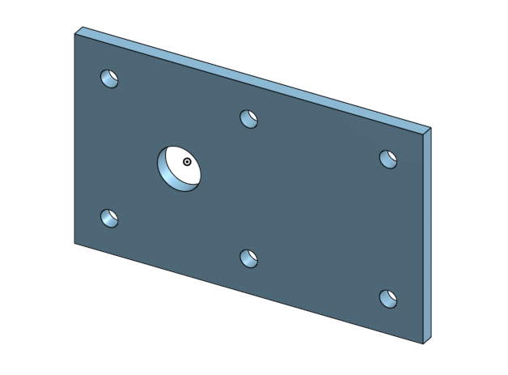
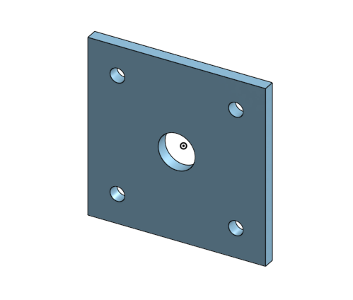
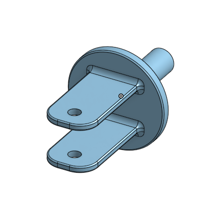
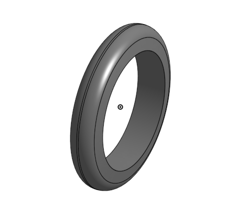
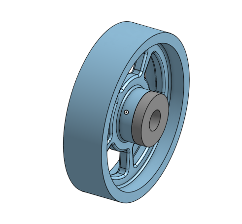
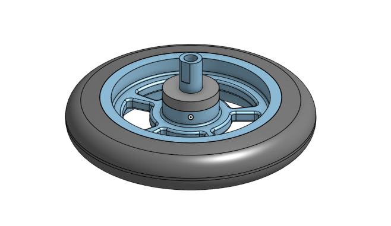
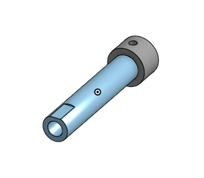
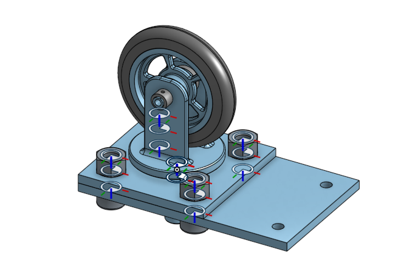

# Basic_Onshape_CAD
A repository for all of my basic OnShape assignments. 
## Caster Base
First assignment on Onshape was to create the base to a wheel caster by making a rectangle, extruding it, and cutting 7 holes in it using linear pattern and other new features. 
### Images

## Caster Mount
Second assignment on Onshape was to create the Mount to a wheel caster by making a square, extruding it, and cutting 4 holes in each corner of the square and a middle hole for the fork. 
### Images

## Caster Fork
The third onshape assignment was to create a circle and extrude it, then make two fork-like structures on one side and a cylinder on the opposite side. This is what is going to hold the wheel in place. 
### Images

## Caster Tire
The next assignment was to make a tire for the wheel by revolving a trapazoid around the origin. 
### Images

## Caster Wheel
This assignment was to create a wheel for the tire to go around. Made by creating an I shape and making a revolved extrusion. 
### Images

## Caster Wheel and Axel
This assignment was putting the axel and wheel together to make the wheel and axel. 
### Images

## Caster Axel
This assignment was to create an axel to connect the wheel with the fork.  
### Images

## Caster Assembly
The final assembly for the caster. Added bolts and screws.
### Images

